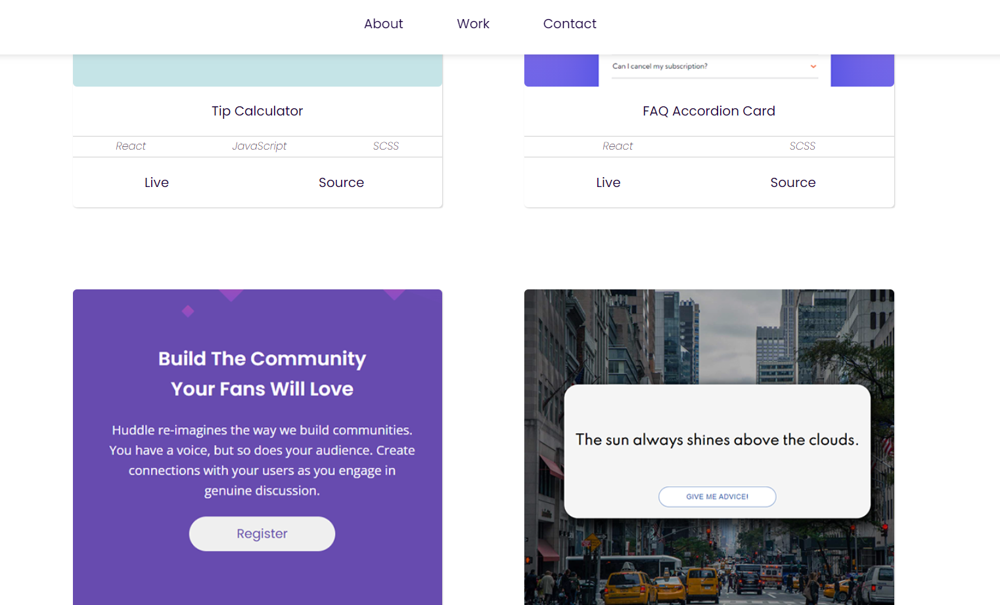

# Marius Bražas Portfolio

This is my github project portfolio where I document my journey as self-taught web developer.

## Table of contents

- [Overview](#overview)
  - [Main goals](#main-goals)
  - [Screenshot](#screenshot)
  - [Projects](#projects)
  - [Built with](#built-with)
- [Author](#author)

## Overview

### Main goals

Main goals:

- Learn to build interactive, modern looking web applications
- Get good at JavaScript fundamentals
- Learn React
- Become Front-End Web Developer
- Learn MERN Stack
- Become FUll-Stack JavaSript Developer

### Screenshot

### Projects

- [Huddle landing page](https://mariusdevelops.github.io/huddle-landing-page/)
- [FAQ accordion card](https://mariusdevelops.github.io/faq-accordion-card/)

### Built with

- [HTML](https://developer.mozilla.org/en-US/docs/Web/HTML) - HyperText Markup Language
- [CSS](https://developer.mozilla.org/en-US/docs/Web/CSS) - Cascading Style Sheets

## Author

- Website - [Marius Bražas](https://mariusdevelops.github.io/)
